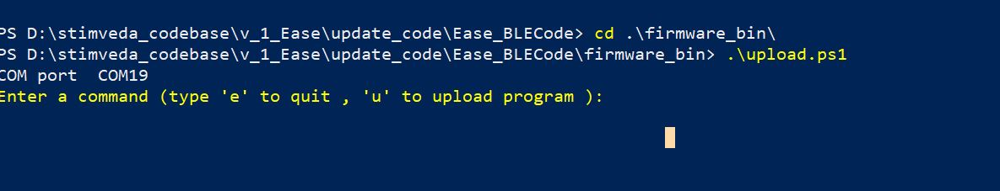
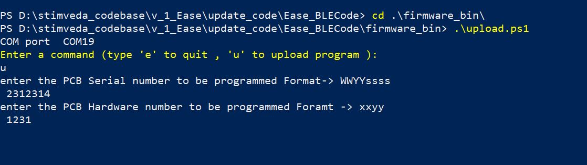
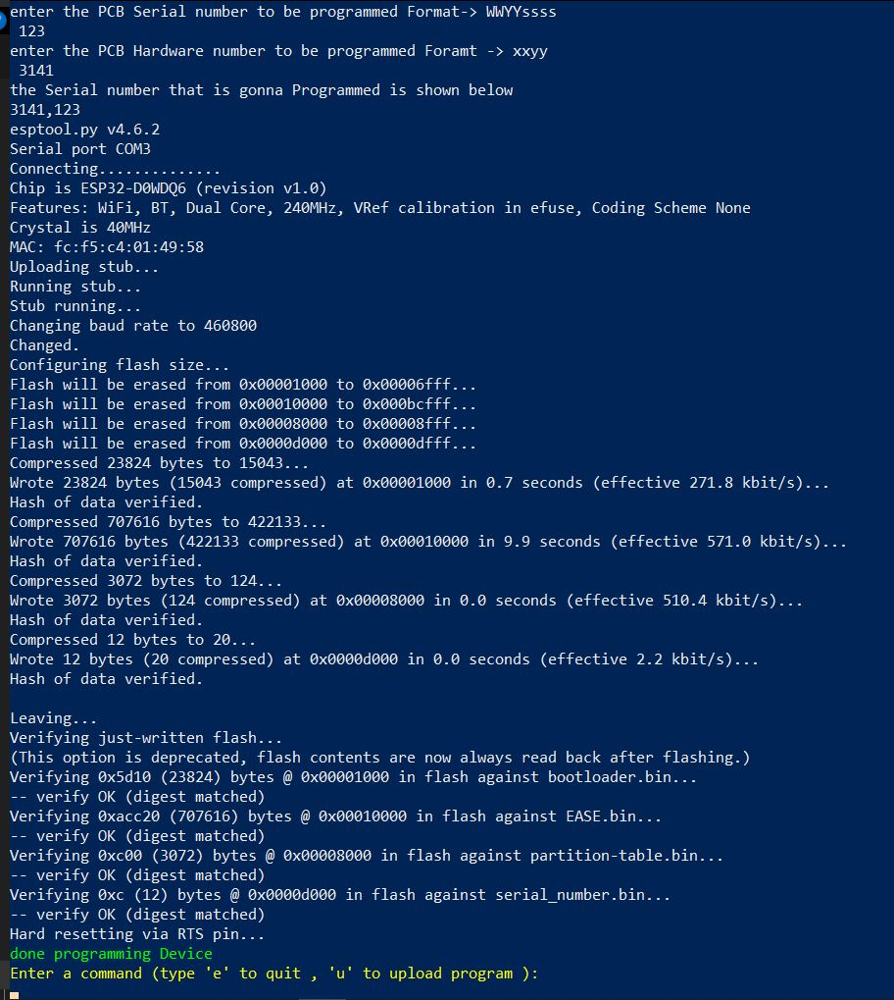

## Uploading the Firmware to the device

To upload the firmware to the device , I build a tool that is used to get the device information data from the user and upload all the firmware packages and information on the device. 


#### Step one 
---
copy all the binaries (partition_table.bin, bootloader.bin and main_firmware.bin) that are present in the build directory of the project into the firmware_bin [directory](../firmware_bin). \
Open the shell/cmd in the Firmware_bin directory paste the following command in the terminal 

```shell
pip install -r requirements.txt 

```

#### Step two
---
Turn off the Bluetooth of the system (laptop/desktop used for programming)

plug in the programmer and check its COM port. Update this COM port by opening the 'upload' [shell script](../firmware_bin/upload.ps1) in any text editor and save the file. (This file will be present in Firmware_bin folder)

Execute the following script `\upload.ps1` in firmware_bin directory in the powershell and you will be prompted by this 


#### Step three
---
Enter 'u' to program device. 
After that, enter the PCB information details like PCB Serial number,etc 
**note** --> you cannot program the serial number separately i.e. the firmware , partition_table, bootloader and serial number. All of these items should be programmed by this tool only 


#### Step four
---
Press enter after typing the serial number. Ensure programmer is connected correctly. You can see the `done programing Device` when programmed correctly.



### Problems
--- 
If there are problems in succesful programming the device refer the possible reasons below:

- Wrong COM port specified in the `upload` powershell script.
- ALL of the files are not copied to the firmware_bin [directory](../firmware_bin).
- Programmer is not connected correctly or power supply on board not proper. 
- requirements.txt is not installled properly.  


